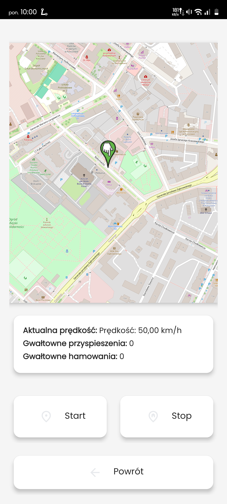

Programowanie urządzeń mobilnych laboratorium L_X_ 

# Dokumentacja projetu: **RoadChampion - licznyk gwałtownych przyśpieszeń i zahamowań**

## Zespoł projetowy:
Krzysztof Pomarański

## Opis projektu
Aplikacja ma za zadanie mierzyć ilość gwałtownych przyśpieszeń podczas poruszania się, dodatkowymi funkcjami są także obliczanie średniej prędkości z pokonanej trasy oraz możliwość podglądania jak dana trasa wyglądała na mapie po jej zakończeniu.

## Zakres projektu opis funkcjonalności:
### Rejesterowanie trasy przejazdu
  Użytkownik po rozpoczęciu śledzenia trasy rejestruje swoją drogę wraz z każdym gwałtownym przyśpieszeniem lub hamowaniem. Aplikacja ma możliwość podglądu trasy na żywo wraz z realną prędkością przedstawioną pod mapą
### Zapisywanie przejazdów w bazie danych
  Użytkownik ma możliwość przeglądania histori wszystkich zapisanych tras wraz z narysowanymi na mapie punktami oraz zobaczyc statystyki takie jak godzina rozpoczęcia i zakończenia, przebyty dystans, czas trwania, średnia prędkość oraz liczba gwałtownych hamowań
### Personalizacja aplikacji
  Użytkownik ma do wyboru tryb ciemny oraz jasny jak również i możliwość włączenia/wyłączenia wibracji podczas klikania przycisków czy też zmiana zdjęcia profilowego zrobionego wprost do aplikacji lub wybranego z galerii.
### Testowanie akcelerometru
  Użytkownik ma możliwość testowania akcelerometru czy wykrywa on gwałtowne przyśpieszenia/hamowania czy też jest w stanie wsględnego spoczynku

## Panele / zakładki aplikacji 
| **Menu główne (jasny)** | **Menu główne (ciemny)** |
|--------------------------|--------------------------|
|  |  |

| **Nowa trasa (jasny)** | **Nowa trasa (ciemny)** |
|-------------------------|-------------------------|
|  |  |

| **Rozpoczęcie nowej trasy** | **Lista tras w historii** |
|-----------------------------|---------------------------|
|  |  |

| **Detale trasy** | **Panel ustawień** |
|------------------|-------------------|
|  |  |

| **Test akcelerometru** | **Zmiana profilowego** |
|------------------------|-----------------------|
|  |  |

## Baza danych

  

Baza danych składa się z 2 tabel. Pierwsza z nich przechowuje dane na temat czasu startu i końca danej trasy, średniej prędkości z trasy, ilości przyśpieszeń i hamowań oraz długości trasy i czasu trwania, natomiast druga tabela jest w relacji 1:N z zapisanymy koordynatami każdego zapisanego punktu lokalizacji wraz z sygnaturą czasową timestamp.

## Wykorzystane uprawnienia aplikacji do:
- Lokalizacji,
- Czujnika przyśpieszenia liniowego,
- Wibracji,
- Kamery,
- Zdjęć

Aplikacja nie potrzebuje żadnej wstępnej konfiguracji, jest w postaci "install&play"
